# How it works: end to end

> Learning-tier explainer. It traces the *actual* code in
> [`cloudflare/worker/src`](../../cloudflare/worker/src), not the intended
> design. For the runtime shape see
> [`overview.md`](overview.md); for the *why* behind each choice see
> [`decisions.md`](decisions.md) (referenced as **A1–A12** below). Storage
> bindings live in
> [`cloudflare/worker/wrangler.jsonc`](../../cloudflare/worker/wrangler.jsonc).

The whole product is one Cloudflare Worker (Hono router,
[`src/index.ts`](../../cloudflare/worker/src/index.ts), `export default
createWorker()` at the bottom of the file). There is no sibling service, no
Python runtime, no separate API tier (decision **A1**). Everything below runs
inside that one Worker plus its Cloudflare bindings.

## The components

| Component | Binding | Code | Holds |
| --- | --- | --- | --- |
| Router / all routes | — | `index.ts` | HTTP surface, both pipelines |
| Metadata DB | `DB` (D1 `rag-db`) | [`d1-repository.ts`](../../cloudflare/worker/src/d1-repository.ts), [`kb-metadata-repository.ts`](../../cloudflare/worker/src/kb-metadata-repository.ts) | `indexes`, `documents`, `chunks`, domains, schemas, entities, jobs, traces, evals |
| Vector store | `VECTORIZE` (+ `_384/_768/_1024`) | `index.ts` (`vectorizeProfileForIndex`) | dense embeddings, one index per dimension |
| Blob store | `RAW_DOCS` (R2) | `index.ts` | raw uploaded bytes + parse artifacts |
| Embeddings | `FREE_AI` service binding / `AI` | [`free-ai.ts`](../../cloudflare/worker/src/free-ai.ts), [`embeddings.ts`](../../cloudflare/worker/src/embeddings.ts) | text → vectors |
| Async ingest | `INGEST_QUEUE`, `KB_INGEST_WORKFLOW` | `KbIngestWorkflow` in `index.ts`, `queue()` export | durable parse/embed pipeline |
| Parser | — | [`document-parser.ts`](../../cloudflare/worker/src/document-parser.ts) | bytes → text + page/bbox elements |
| Chunker | — | [`chunk.ts`](../../cloudflare/worker/src/chunk.ts) | text → overlapping chunks |
| Caches | — | [`cache.ts`](../../cloudflare/worker/src/cache.ts) | in-isolate TTL caches for answers, embeddings, indexes |

Storage is split by strength (**A2**): D1 for SQL metadata, Vectorize for dense
search, R2 for content-hashed bytes. Joining them in the Worker is cheap;
replacing any one is bounded.

### Embeddings: which model actually runs

Despite `EMBEDDING_MODEL` defaulting to a Workers AI `bge` model in
`wrangler.jsonc`, the live config sets `RAG_EMBED_PROVIDER: "free_ai"`, so the
active path is `freeAiEmbed` in
[`free-ai.ts`](../../cloudflare/worker/src/free-ai.ts): it calls the fleet
`free-ai-gateway` Worker (via the `FREE_AI` service binding — a plain fetch to
`*.workers.dev` is blocked same-zone, hence the binding) and requests
`gemini-embedding-001` at **1536 dimensions**. That maps to the default
`VECTORIZE` index (`rag-gemini-1536`). Workers AI `bge` (768/384) remains the
fallback in [`embeddings.ts`](../../cloudflare/worker/src/embeddings.ts). The
model/provider are pinned with `x-gateway-force-*` headers and the returned
vector length is validated — a wrong-dimension response **fails closed** rather
than corrupting the index.

## Diagram

```mermaid
flowchart TD
    subgraph Ingest["Ingest path (async)"]
        U[Upload / URL / EDGAR / text] --> R2[(R2 raw bytes)]
        U --> JOB[D1 file + job row]
        JOB --> WF[KbIngestWorkflow: validate]
        WF --> Q[INGEST_QUEUE]
        Q --> CONS["queue consumer"]
        CONS --> P[document-parser.ts]
        P --> CH[chunkText]
        CH --> EMB1[embed via free-ai / Workers AI]
        EMB1 --> D1C[(D1 chunks)]
        EMB1 --> VUP[(Vectorize upsert)]
    end
    subgraph Query["Query path (runKbAnswer)"]
        QN[POST /v1/kb/query] --> ST{mode != semantic?}
        ST -->|structured hit| GRAPH[D1 entity + graph fast path]
        ST -->|else| AC{answer cache?}
        AC -->|hit| RESP
        AC -->|miss| EMBQ[embed question]
        EMBQ --> VQ[(Vectorize dense query)]
        EMBQ --> LEX[(D1 lexical / fuzzy)]
        VQ --> RRF[RRF fuse]
        LEX --> RRF
        RRF --> RR[rerank + optional MMR]
        RR --> ANS[extractive answer<br/>or opt-in Workers AI synth]
        GRAPH --> ANS
        ANS --> VER[deterministic citation verify]
        VER --> RESP[cited answer + trace]
    end
```

## How a document flows in (ingest)

Ingestion is asynchronous by default so uploads return fast (**A8**). The
route accepts many entry shapes — `/v1/kb/files/upload` (raw bytes to R2 + a D1
file/job row), `/v1/kb/ingest/record` and `/v1/kb/ingest/text` for direct
structured/text input, plus URL and EDGAR imports.

1. **Land the bytes.** Raw upload bytes go to R2 keyed by content hash; a file
   row and an ingest job row are written to D1.
2. **Dispatch durably.** `/v1/kb/ingest/run` prefers the Workflow-backed queue
   when `KB_INGEST_WORKFLOW` is bound, falls back to a direct
   `INGEST_QUEUE.send`, and only runs inline when `async:false` is passed
   explicitly (a debug override, never the production default — **A8**). The
   Workflow itself (`KbIngestWorkflow.run`) is deliberately thin: it *validates*
   the payload and *enqueues* the queue message with retry/backoff. The heavy
   work happens in the queue consumer (the `queue()` export at the bottom of
   `index.ts`, wired to `knowledgebase-ingest` with `max_retries: 3`), which
   must be idempotent because retries can redeliver a message.
3. **Parse.** [`document-parser.ts`](../../cloudflare/worker/src/document-parser.ts)
   turns bytes into text plus **elements carrying page + bbox metadata**. It
   handles text/JSON/NDJSON/CSV, HTML, digital-PDF text with
   coordinate-derived table rows, XLSX, DOCX, PPTX in pure TypeScript; Workers
   AI Markdown Conversion covers unsupported/scanned files, and vision OCR is
   opt-in via `RAG_VISION_OCR_MODEL` (**A7**). Parse artifacts are cached at the
   *element* boundary keyed on `sha256(bytes)` so re-extraction under a changed
   schema is cheap (**A6**).
4. **Chunk.** `chunkText`
   ([`chunk.ts`](../../cloudflare/worker/src/chunk.ts)) is a greedy
   paragraph packer: split on blank lines, accumulate paragraphs up to `size`
   (default **2000**, clamped 100–8000), and hard-slice oversized paragraphs
   with `overlap` (default **200**). Chunk and document IDs are *deterministic*
   (`deterministicId` over `tenant:index:external_id:i:chunk`) so re-ingesting
   the same document upserts in place instead of duplicating.
5. **Embed + store.** `ingestDocumentsToIndex` embeds all pending chunk texts
   in one batch through the same `embed` seam the query path uses, writes the
   chunk rows to D1 (`insertChunks`, `INSERT OR REPLACE`), and upserts the
   vectors into the dimension-matched Vectorize index. Each vector is namespaced
   by `(tenant, index)` and carries chunk metadata so most reads can be served
   from Vectorize metadata alone. When the index is the base profile, a parallel
   small-profile embedding can also be upserted.

## How a query flows out (answer)

The entry point is `POST /v1/kb/query` → `runKbAnswer` in `index.ts`. Auth is
service-key based with per-tenant isolation (**A9**), and every path converges
on the same `(file_id, page, excerpt)` citation triple — *cited or it didn't
happen* is enforced structurally, not left to a prompt (**A3**).

1. **Structured / graph fast path first.** Unless `mode: "semantic"` is
   requested, `runKbAnswer` first tries D1 exact structured field matching and
   entity search (`structuredFieldQueryResults`, `searchEntities`) and expands
   the relationship graph (`graphResultsForEntities`). If entities match, it
   answers directly at `confidence: high` and **skips embedding entirely** —
   exact-term and entity-filter questions never pay Vectorize latency (**A4**).
2. **Resolve the domain index and check the answer cache.** For semantic
   questions it looks up the per-domain index, then (for non-session requests)
   checks the in-isolate answer cache keyed on the normalized question + query
   options. Cache and normalized-embedding caches cover hot/repeated questions
   across isolates, not first-seen cold misses (**A4**).
3. **Retrieve — dense + sparse in parallel.** `queryByVector` embeds the
   question and queries the dimension-matched Vectorize index (namespaced by
   tenant/index, with a metadata-filter fallback when the namespace returns
   nothing). `queryByLexical` runs an in-Worker sparse path: it loads the
   index's chunk rows from D1 (`listChunksForIndex`, up to `MAX_LEXICAL_CHUNKS`
   = 5000, cached per tenant/index in `getCachedLexicalChunks`) and scores them
   in the isolate with `sparseLexicalScore` — a real **BM25** kernel
   (`k1 = 1.2`, `b = 0.75`, IDF + length-normalized TF) over fuzzy-matched
   tokens (stems, trigrams, bounded edit-distance — see
   `lexicalTokenSimilarity`/`bestLexicalMatch`; scoring version
   `bm25_fuzzy_sparse_v3`). This is *functional* hybrid parity over D1 chunks,
   deliberately **not** the old Qdrant BM42 model — don't claim BM42
   equivalence (**A4**). (A D1 `LOWER(content) LIKE` method,
   `searchLexicalChunks`, exists on the repository but is not on the live query
   path.)
4. **Fuse.** `fuseHybridResults` combines the two ranked lists with Reciprocal
   Rank Fusion — each list contributes `1 / (60 + rank + 1)` per chunk, scores
   sum, top-K wins. Multi-query fanout (`query_rewrite` /
   `query_decompose`, on by default for compound questions) is fused the same
   way in `fuseQueryPlanResults`.
5. **Rerank + diversify.** In the fused/hybrid path, `rerankQueryPayload` →
   `rerankAndDiversifyResults` reorders results. The **default reranker is
   keyword overlap** (a lightweight `score + query-token-overlap` boost) and
   MMR diversity is on by default (`mmr !== false`); a neural Workers AI
   reranker (`@cf/baai/bge-reranker-base`) is **opt-in** via
   `rerank_model: "workers_ai"`. These knobs are tuned **per domain, not
   globally** — SEC and Legal flip the sign on MMR (**A5**). A weak semantic
   result set triggers a corrective re-run that folds in lexical results
   (`corrective_hybrid`).
6. **Answer + verify.** By default the answer is **extractive** — sentences
   pulled straight from the top chunks with `[n]` citations. Workers-AI/free-ai
   cited *synthesis* is opt-in via `answer_mode: "workers_ai"`
   (`synthesizeAnswerWithAi`, and the synthesized answer is only accepted if it
   actually contains `[n]` markers). Either way, `answerFromEvidence` builds the
   citation list from chunk/entity/provenance metadata and verifies it
   deterministically before the answer ships; confidence is downgraded by the
   per-claim verify pass rate (**A3**).
7. **Trace + respond.** Every query writes a D1 query trace and an Analytics
   Engine event, optionally appends to session history, and returns the answer,
   citations, confidence, retrieved data, and timing headers.

## Key decisions, in one line each

Each links to its full rationale in [`decisions.md`](decisions.md).

- **One Worker, no sibling** — one deploy, one auth, one cost surface (**A1**).
- **D1 + Vectorize + R2 split** — each primitive does one job well (**A2**).
- **Cited or it didn't happen** — citations are a verified data invariant (**A3**).
- **Cloudflare-native hybrid** — dense + D1-sparse + RRF replaces Qdrant BM42 (**A4**).
- **Per-domain tuning** — MMR/rewrite/rerank are per corpus, not global (**A5**).
- **Parse once, re-extract many** — element-level parse cache on `sha256(bytes)` (**A6**).
- **TS parsing, opt-in vision OCR** — no ported Python OCR stack (**A7**).
- **Async ingest via Queues + Workflows** — upload returns fast; retries idempotent (**A8**).

## Where to go next

- Call the API: [`product/agent-tool-contract.md`](../product/agent-tool-contract.md)
- Add a corpus: [`product/onboard-new-domain.md`](../product/onboard-new-domain.md)
- Operate a deploy: [`operations/runbook.md`](../operations/runbook.md)
- Async ingest details: [`operations/jobs.md`](../operations/jobs.md)
- Durable lessons: [`knowledge/learnings.md`](../knowledge/learnings.md)
