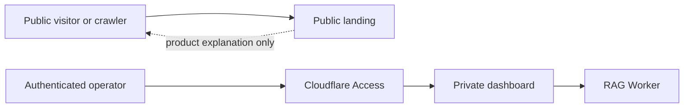

## Context

Knowledge Base has three different trust boundaries that must not be collapsed:

The public landing describes the product and its public history. It does not
proxy the Worker or expose private corpus state. The private dashboard remains
the only browser surface for operator data.

## Decisions

### Use a separate static package

The landing will live in its own source directory with its own build output.
It will not reuse the private dashboard shell or its Pages Functions. This
keeps Cloudflare Access and Worker credentials out of the public deployment.

### Derive all discovery surfaces from one registry

One typed route registry will own canonical HTML routes, Markdown
counterparts, sitemap membership, and `/api/ai` entries. The sitemap will
contain HTML routes only; machine files remain discoverable through
`robots.txt`, `llms.txt`, and the agent catalog.

### Keep release work separate

Local work may prove that the package builds and passes the Fleet agent audit.
Changing the Pages root/build output, deploying, or modifying DNS requires
explicit release authorization and post-deploy remeasurement.

## Validation

- Typecheck and production build the landing.
- Assert every sitemap route has a Markdown counterpart and every catalog
  entry resolves within the built output.
- Run the Fleet agent-readiness audit against a local production preview using
  the canonical-host test mode or equivalent deterministic artifact check.
- Confirm no private dashboard, corpus, citation, credential, or Worker route
  appears in the public output.
